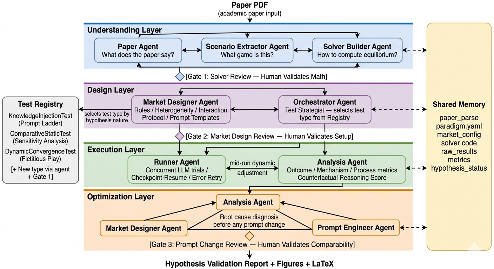

# Phase 2 工作汇报（更新于 2026-03-24）

---

## 一、系统架构设计（保留）

### 1.1 设计原则

1. Paradigm-as-Contract
- `paradigm.yaml` 作为研究意图与执行系统之间的契约。
- 研究者定义“测什么/为什么测”，系统负责“怎么测”。

2. 交互式协作网络（非流水线）
- 各层 Agent 通过消息通信协作，支持多轮协商与反馈。
- 不采用固定 A->B->C 单向流水线。

3. 输入即论文 PDF
- 从论文出发自动抽取场景、假设、测试与执行配置。

4. Test Registry 可扩展
- 测试类型通过注册机制扩展，不与单一场景硬绑定。

### 1.2 四层多 Agent 架构

- Layer 1（理解层）：`paper_agent`、`scenario_extractor`、`solver_builder`，产出论文结构化结果、假设契约、求解器。
- Layer 2（设计层）：`market_designer`、`orchestrator`，产出 `market_config.yaml` 和 Gate2 审核请求。
- Layer 3（执行层）：`runner`、`analysis`，执行测试并汇总假设验证结果。
- Layer 4（优化层）：`analysis_l4`、`prompt_engineer`、`market_designer_review`，在需要时生成提示词优化与 Gate3 请求。

### 1.3 Gate 机制

- Gate 1：审阅 L1 产物（解析、假设、求解器）。
- Gate 2：审阅实验设计（模型池、测试配置、预算约束）。
- Gate 3：审阅提示词优化变更（可比性与风险）。

### 1.4 共享内存与通信

- 共享内存：`phase2/workspace/`。
- 消息队列：`phase2/workspace/messages/`。
- Gate 文件：`gate{n}_request.json` 与 `gate{n}_approved.json`。

### 1.5 核心概念强定义

1. `Hypothesis`
- 最小必填字段：`id`、`statement`、`nature`、`preferred_test`、`success_criterion`。
- `nature` 仅允许：`comparative_static` / `knowledge_dependent` / `dynamic_convergence`。
- 语义：一条可执行、可判定真伪的研究主张。

2. `Paradigm`
- 必须包含非空 `hypotheses` 列表，否则视为不可执行契约。
- 语义：从论文抽取出的可执行研究规范，驱动 Layer 2/3。

3. `Market Config`
- 必须由 `hypothesis_map + tests + models` 组成可执行配置。
- 若 `hypothesis_map/tests` 为空，运行应中止而不是继续空跑。

---

## 二、当前实现进展

### 2.1 已完成

1. Layer 1
- 三个 Agent 可启动并协作。
- 可产出 `paper_parse.json`、`paradigm.yaml`、`solver/solver_b.py`、`gate1_request.json`。
- 已支持真实 API 调用重试（含连接错误重试与超时配置）。
- 已收紧 `hypotheses` 结构约束，强制 `nature -> preferred_test` 一一对应。

2. Layer 2
- 可从 `paradigm.yaml` 生成 `market_config_draft.json` 与 `market_config.yaml`。
- 可产出 `gate2_request.json`，并等待 Gate2 审批。
- 已拒绝生成 `unrecognized test type` 的半残配置。

3. Layer 3
- `runner` 与 `analysis` 交互循环已实现。
- 每个 job 已改为独立子进程执行，避免单个 native 崩溃直接杀死整个 L3。
- 已增加 `runner_state.json`、子实验级进度字段和 emergency summary。
- 已成功生成 `metrics/layer3_summary.json`、`metrics/hypothesis_status.json`、`raw_results/run_manifest.json`。

4. Layer 4
- 交互循环已实现。
- 可产出 `optimization/root_cause_diagnosis.json`、`prompt_change_proposal_*.json`、`comparability_review.json`。
- 但本轮真实回归未触发新的 Gate 3。

5. 审批模板与复盘文档
- G1/G2/G3 审批模板和示例文件已补齐。
- 已新增 `L1_L3_RUN_REVIEW.md`，用于复盘本次真实运行。

### 2.2 最新联调结果（2026-03-24）

- 已完成一次从 L1 到 L3 的真实 API 完整回归。
- L1 已通过 Gate 1，L2 已通过 Gate 2。
- L3 已真实执行完成，不再是 `jobs_total=0`。

本轮 L3 结果如下：

- `jobs_total=12`
- `jobs_ok=8`
- `jobs_error=4`
- `events_processed=12`
- `estimated_calls_used=12/2500`
- `PASS=0`
- `FAIL=3`
- `INCONCLUSIVE=0`

本轮 hypothesis 状态：

- `H1 = FAIL`
- `H2 = FAIL`
- `H3 = FAIL`

本轮 Gate 3：

- 未触发。

---

## 三、遇到的主要问题（仅问题，不含方案）

1. 真实 API 环境仍存在不稳定性。
- 出现过连接类错误，影响长链路稳定执行。

2. 运行结果仍然高度依赖 Gate 文件状态。
- 审批文件状态会显著影响层间推进与自动化测试连贯性。

3. `preferred_test` 曾被 L1 写成自然语言描述，而不是注册测试名。
- 这会导致 Layer 2 生成 `unrecognized test type` 的半残 `market_config.yaml`。
- 同时造成“配置层写的是自由文本，执行层却按 `nature` 回退到注册测试类”的语义分裂。

4. Layer 3 曾在 Phase 1 复用实验内部发生 native 级崩溃。
- 日志中出现 `forrtl: error (200): program aborting due to window-CLOSE event`。
- 这说明底层实验依赖仍可能在 L3 内部触发进程级异常。

5. Layer 3 的调度键与执行键曾不一致。
- `runner` 用 hypothesis 中的 `preferred_test` 建队列与取配置。
- 测试注册表又会在找不到注册测试名时按 `nature` 回退。
- 结果是“看起来配置了一套实验，实际跑的是另一套实验”。

6. H1 的 `SensitivityTest` 仍然过重。
- 本轮 H1 共形成 6 个结果样本，其中 4 个以 `worker timeout (>1800s)` 结束。
- 当前 30 分钟 worker 超时对重型 sensitivity job 仍不稳。

7. 三条 hypothesis 本轮全部 `FAIL`。
- H1：成功跑完的模型结果也未满足单调不增。
- H2：prompt ladder 指标未呈现单调上升。
- H3：fictitious play 未收敛到目标条件。

8. H1 的理论表述、solver 自检与 L3 结果之间仍有语义张力。
- `paradigm.yaml` 中 H1 表述为“rho 增加，share_rate 下降”。
- 但 `solver_signoff.json` 的 test2 只得到 `rho=0.3 share=0.500, rho=0.9 share=0.500`。
- L3 的 sensitivity 结果进一步显示该关系并不稳定成立。

9. 系统虽然已能真实跑通，但“能跑通”与“研究结论可信”还是两件事。
- 当前更像是系统链路验证成功，而不是论文假设已经被可靠复现。

---

## 四、下一步计划

1. 优先修复 L3 的 H1 执行稳定性。
- 重点处理 `SensitivityTest` 的 job 粒度、超时策略和重试成本。

2. 复核 H1 的研究语义。
- 对齐 `paradigm.yaml`、`solver_signoff.json` 与 L3 sensitivity 实测结果，确认是假设方向有误、solver 过弱，还是实验判据需要重写。

3. 继续提升运行可观测性。
- 保留子实验级进度、job artifact、summary 汇总，并补充更便于人工复盘的说明文件。

4. 在 L3 稳定后，再决定是否推进 Gate 3 / Layer 4 的真实优化回路。

### 当前修复 TODO

- [x] 将 `preferred_test` 收紧为注册测试名，不再允许自然语言自由填写。
- [x] 强制校验 `nature -> preferred_test` 一一对应关系。
- [x] 在 Layer 2 拒绝生成 `unrecognized test type` 的半残配置。
- [x] 将 Layer 3 每个 job 放入独立子进程执行，隔离 Phase 1 native 崩溃。
- [x] 为 Layer 3 增加 emergency summary，确保异常退出时也有可审计产物。
- [x] 为 Layer 3 增加子实验级进度汇报。
- [x] 重跑 L1 -> L3 真实 API 回归。
- [ ] 修复 H1 `SensitivityTest` 的 timeout / 粒度问题。
- [ ] 复核 H1 假设、solver 自检与 L3 实测之间的语义一致性。

---

## 五、当前文件状态（按模块）

### 5.1 关键入口与设计文档

- `phase2/DESIGN.md`：架构设计文档。
- `phase2/PROGRESS.md`：当前进展文档（本文件）。
- `phase2/L1_L3_RUN_REVIEW.md`：本次真实 L1-L3 运行复盘文档。
- `phase2/layer1_coordinator.py`：L1 协调入口。
- `phase2/layer2_coordinator.py`：L2 协调入口。
- `phase2/layer3_coordinator.py`：L3 协调入口。
- `phase2/layer4_coordinator.py`：L4 协调入口。

### 5.2 agents/

- `paper_agent.py`、`scenario_extractor.py`、`solver_builder.py`。
- `market_designer.py`、`orchestrator.py`。
- `runner.py`、`analysis.py`。
- `analysis_optimizer.py`、`prompt_engineer.py`、`market_designer_review.py`。

### 5.3 tools/

- `file_io.py`（workspace 与消息读写）。
- `agent_api_client.py`（统一 API 调用层）。
- `pdf_reader.py`（论文文本抽取与分段）。

### 5.4 tests/

- `base_test.py`、`sensitivity_test.py`、`prompt_ladder_test.py`、`fictitious_play_test.py`。
- `job_worker.py`：Layer 3 子进程执行入口。

### 5.5 templates/

- `gate1_approved.template.json`
- `gate2_approved.template.json`
- `gate3_approved.template.json`

### 5.6 workspace 当前关键产物（最新一轮）

- 已有：
  - `input/paper.pdf`
  - `paper_parse.json`
  - `paradigm.yaml`
  - `solver/solver_b.py`
  - `solver_signoff.json`
  - `market_config_draft.json`
  - `market_config.yaml`
  - `metrics/runner_state.json`
  - `metrics/hypothesis_status.json`
  - `metrics/layer3_summary.json`
  - `raw_results/run_manifest.json`
  - `raw_results/H1_*.json`
  - `raw_results/H2_*.json`
  - `raw_results/H3_*.json`
  - `raw_results/sensitivity/**`
  - `raw_results/prompt_ladder/**`
  - `raw_results/fictitious_play/**`
  - `messages/*.json`
  - `gate1_request.json`
  - `gate2_request.json`

- 状态备注：
  - L3 已完成真实执行，不再是 `jobs_total=0`。
  - 当前 summary 为：`jobs_total=12`、`jobs_ok=8`、`jobs_error=4`、`PASS=0/FAIL=3`。
  - 本轮未触发 Gate 3，Layer 4 暂未进入新一轮真实优化回路。
